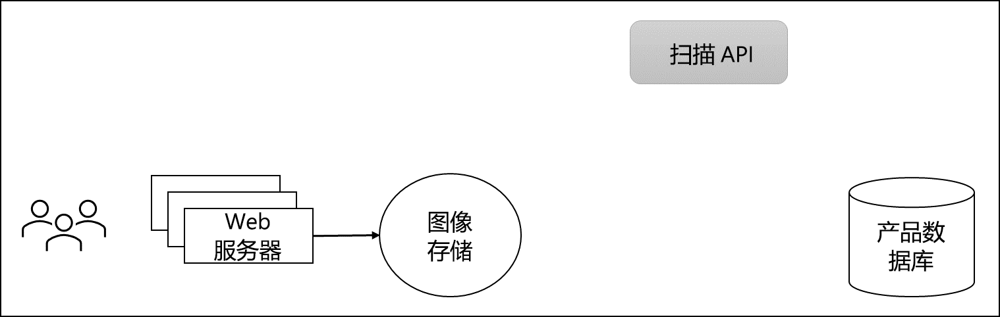

---
casestudy:
  title: 设计应用体系结构解决方案
  module: App architecture solutions
---
# 设计应用体系结构解决方案

## 要求

Tailwind Traders 希望更新其网站，以包含客户提供的产品图像，以及市场营销部提供的现有照片。 他们认为，拥有更多正在使用的产品的照片将使潜在客户更好地了解过去的客户在购买产品后对产品的喜爱程度。 他们确实有一些要求，概述如下：

* 在发布到网站上之前，需要扫描上传的图像。 法务部和市场营销部都要求在初次上传后，对图片进行检查，看是否存在任何对公司不利或可能导致法律问题的问题。 已开发并部署了一个内部 API，可以执行必要的扫描。 

* 基于现有模式，Tailwind Traders 预计图像上传在一天中会非常不均衡。 某些时间段的上传次数可能超过扫描软件的处理能力，而其他时间段的上传次数可能很少或根本没有。

* 系统扫描并批准上传的图像后，Tailwind Traders 希望客户收到一封电子邮件，感谢他们共享其图像。

* 该解决方案的成本和管理是一个问题，尤其是由于 Tailwind Traders 不确定此功能最初会有多受欢迎。 尽可能降低成本并利用无服务器解决方案。

 

 

## 任务

为要添加到公司网站的客户图像设计体系结构。 

* 图像应存储在何处？

* 如何确保所有的图像都被扫描，即使上传速度超过扫描速度？

* 图像获得批准并更新目录数据库后，将如何通知客户？ 

如何整合“体系结构良好的框架”支柱，以生成高质量、稳定且高效的云体系结构？

 
