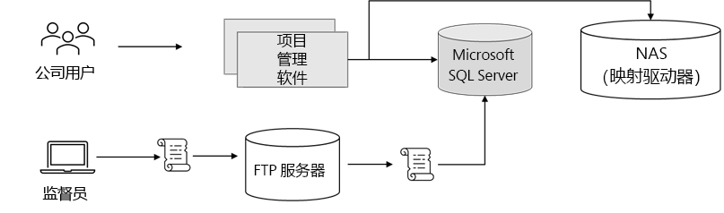
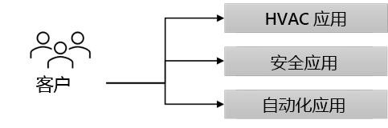

---
casestudy:
  title: Fabrikam Residences
  module: Logging and monitoring solutions
---
# 案例研究：Fabrikam Residences

## 要求

**此案例研究要求你已完成以下模块和案例研究：计算、关系数据、非关系数据、身份验证、应用程序体系结构**

你在 Fabrikam Residences 担任新职位，该公司非常成功，正经历着快速发展。 Fabrikam Residences 是新房和大型房屋翻新的建筑承包商，通过提供优质建筑和提供比竞争对手更新的集成家居技术而获得成功。  

目前，这些技术由独立的分包公司提供和管理。 Fabrikam Residences 的所有者希望开始在内部提供这些升级的技术选项，以提供更好的质量、支持和有关客户模式和需求的数据。 
 
最初，该公司希望提供 HVAC（采暖和制冷）控制和监视、安全系统监视和警报，以及家庭自动化。 这需要一个新的网站、数据存储解决方案和数据引入解决方案。

在过去的两年中，该公司取得了巨大的发展。 该公司估计，在未来 12-18 个月内，其规模可能会翻一番。 在区域市场增长如此之快的情况下，公司目前没有向区域市场以外扩张的计划。

## 当前情况

Fabrikam 总部在单个位置运营一个小型数据中心。 该数据中心托管公司**项目管理 (PM) 软件**。

- PM 软件使用第三方 Windows 应用程序。 该应用程序在具有单个 Microsoft SQL Server 后端的 2 节点网络负载均衡 (NLB) 群集上运行。  

- 图像和文档存储在服务器的映射驱动器上，该驱动器驻留在专用 NAS 设备上。

- 企业用户和办公室工作人员使用 Web 前端输入数据，例如供应交付计划和变更单。

-   现场主管使用脱机的 Windows 笔记本电脑和平板电脑持续记录建筑进度和其他详细信息。  这些更改（例如新工单）存储在本地更改文件中。  每天结束时，主管返回办公室连接无线网络并运行一个小脚本将更改文件上传到 FTP 服务器。  第二个脚本计划每晚运行，以处理所有更改文件，并将其内容输入项目管理数据库 (Microsoft SQL Server)。

家庭技术软件目前由第三方提供和托管，涉及客户必须访问的至少三个不同的网站****。  建议将该软件替换为内部开发的统一解决方案。

## 要求 

**项目管理软件**

- 将尽可能多的系统迁移到公有云提供商。

- 出现安全问题时，替换现有的脚本以利用比 FTP 更安全的系统。 此外，系统要求你确保更改文件在上传后立即得到处理。

- 提高项目管理数据库的复原能力。 虽然性能不是问题，但公司希望避免在出现单个硬件故障时失去对数据库的访问权限。

**新家庭技术解决方案**

- 添加一个新解决方案，从家庭监视传感器持续收集数据。
  - 为一些传感器读数建立数据库，用于趋势分析和报告。
  - 根据所有者需求提供可配置的实时警报。
  
- 设计一个关系数据库解决方案来保存房主的偏好和设置。
  - 系统必须可缩放。
  - 冗余至关重要。
  
- 新的统一网站将在内部开发，并托管在 Linux 上。  此网站将用于查看监视器并更改温度或警报阈值等项目的偏好。 负载可能变化很大，并且系统必须能够快速缩放。

-   为用户提供一种登录系统的方法，而无需创建另一个用户帐户和密码。

- 实施安全控制并每周提供报告，概述公司如何与行业标准最佳做法匹配。

## 任务 

1. 为项目管理软件设计解决方案。 请准备好解释为何选择设计的每个组件以及它如何满足解决方案的要求。

2. 为新家庭技术解决方案设计体系结构。 请准备好解释为何选择设计的每个组件以及它如何满足解决方案的要求。

如何整合“体系结构良好的框架”支柱，以生成高质量、稳定且高效的云体系结构？

