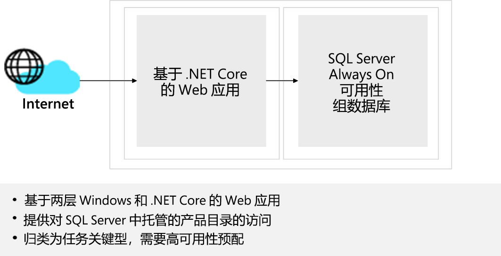

# 设计网络基础结构解决方案  

## 要求

Tailwind Traders Enterprise IT 团队在准备定义将公司的某些工作负荷迁移到 Azure 的策略时，必须确定所需的网络组件并设计支持这些组件所需的网络基础结构。 考虑到其运营遍及全球，Tailwind Traders 将使用多个 Azure 区域来托管其应用程序。 这些应用程序大多依赖于基础结构和数据服务，后者也将驻留在 Azure 中。 迁移到 Azure 的内部应用程序必须始终可供 Tailwind Traders 用户访问。 迁移到 Azure 的面向 Internet 的应用程序必须始终可供任何外部客户访问。 

为了整合初始网络设计，Tailwind Traders Enterprise IT 团队选择了两个关键的应用程序，它们代表了预计将迁移到 Azure 的最常见的工作负载类别。  

### 设计 - 产品目录企业应用程序

- 一个面向 Internet、基于 Windows 的两层 .NET Core Web 应用，提供对 SQL Server Always On 可用性组数据库中托管的产品目录的访问权限。 此应用程序被归类为任务关键型应用程序，可用性 SLA 为 99.99%，10 分钟 RPO 和 2 小时 RTO。 

-   业务主管强调访问面向 Internet 的应用时，最佳客户体验的重要性，因此加载网页和下载静态内容所需的时间必须最小化。 同样，托管 Web 应用组件及其依赖项的服务器的故障对客户感知到的 Web 应用可用性产生的影响应该可以忽略不计。 虽然可以理解，区域性故障可能会对现有 Web 会话造成一些中断，但到灾难恢复站点的故障转移应该是自动的。

- 为了利用 Azure PaaS 服务提供的优势，企业 IT 团队决定使用 Azure SQL 数据库来实现产品目录企业应用程序的数据库。 

- Tailwind Traders 信息安全和风险团队要求，属于同一应用程序的 Azure VM 和 PaaS 服务之间的所有通信都必须通过 Azure 主干（而不是 PaaS 服务的公共终结点）传输。 

## 任务 - 产品目录企业应用程序

1. 为产品目录设计一个两层网络解决方案。 在适当情况下，设计可以包括 Azure Front Door、WAF、Azure 防火墙和 Azure 负载均衡器。 网络组件应分组到虚拟网络中，并且应该考虑网络安全组。 准备好解释为何选择设计的每个组件。 

如何整合“体系结构良好的框架”支柱，以生成高质量、稳定且高效的云体系结构？

