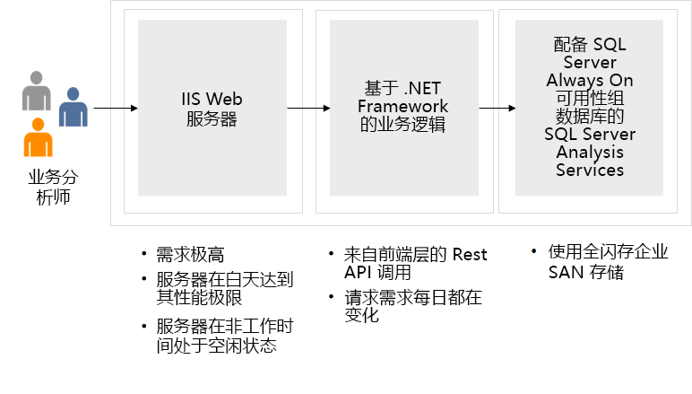

---
casestudy:
  title: 设计网络解决方案 - BI 企业应用程序
  module: Network infrastructure solutions
---
# 设计网络基础结构解决方案  

## 要求

Tailwind Traders Enterprise IT 团队在准备定义将公司的某些工作负荷迁移到 Azure 的策略时，必须确定所需的网络组件并设计支持这些组件所需的网络基础结构。 考虑到其运营遍及全球，Tailwind Traders 将使用多个 Azure 区域来托管其应用程序。 这些应用程序大多依赖于基础结构和数据服务，后者也将驻留在 Azure 中。 迁移到 Azure 的内部应用程序必须始终可供 Tailwind Traders 用户访问。 迁移到 Azure 的面向 Internet 的应用程序必须始终可供任何外部客户访问。 

为了整合初始网络设计，Tailwind Traders Enterprise IT 团队选择了两个关键的应用程序，它们代表了预计将迁移到 Azure 的最常见的工作负载类别。  

## 设计 - BI 企业应用程序 

-   基于 Windows 的内部三层商业智能 (BI) 企业应用程序，前端层运行 IIS Web 服务器，中间层托管基于 .NET Framework 的业务逻辑，后端层实现为 SQL Server Always On 可用性组数据库。 

-   此应用程序归类为任务关键型应用程序，需要预配高可用性（99.99% 可用性 SLA）和灾难恢复（10 分钟 RPO 和 2 小时 RTO）。

-   为了提供与迁移到 Azure 的内部应用的连接，Tailwind Traders 需要从其本地数据中心建立混合连接。 Enterprise IT 组已经确定，此类连接将通过来自其西雅图主数据中心的 ExpressRoute 线路来实现，但目前尚不清楚如果该线路不可用，故障转移解决方案是什么。 Tailwind Traders CFO 希望避免为另一冗余 ExpressRoute 线路付费。 

- 对于与迁移到 Azure 的内部应用的本地连接，还有一些其他注意事项。 由于 Tailwind Traders Azure 环境实际上由多个订阅和多个虚拟网络组成，因此，若要将成本降至最低，必须将实现核心网络功能所需的 Azure 资源的数量降至最低。 这些功能包括与本地位置的混合连接以及流量筛选。 顺便说一句，将成本降至最低的需求符合信息安全和风险要求，这些要求规定，本地位置与 Azure 虚拟网络之间的所有流量必须通过单个虚拟网络流动，该虚拟网络将托管负责混合连接和流量筛选的组件。 

-   根据 Tailwind Traders 信息安全和风险团队定义的要求，属于同一应用程序的不同层中的 Azure VM 之间的所有通信必须仅允许运行和维护应用程序所需的端口。 但是，由于 IP 地址空间限制，可能无法向每个层分配专用子网。 Enterprise IT 组需要确定为不需要直接引用 IP 地址或 IP 地址范围的流量筛选配置源和目标的最佳方式。

## 任务 - BI 企业应用程序 

1. 为 BI 应用程序设计一个三层网络解决方案。 你的设计可能包括 Azure ExpressRoute、VPN 网关、应用程序网关、Azure 防火墙和 Azure 负载均衡器。 网络组件应分组到虚拟网络中，并且应该考虑网络安全组。 准备好解释为何选择解决方案的每个组件。 

2. 根据计算案例研究中的架构师解决方案，这将如何影响网络设计？ 是否需要任何其他网络资源来保护对现代化应用程序的访问？ 是否不再需要在原始网络设计中实现的一些建议的解决方案？ 

3. 根据存储（关系）案例研究，如何更新网络设计，以保护对存储帐户的访问，并确保仅精选用户有权访问存储帐户？

4. 根据 SQL 后端的现代化，计划如何实现对数据库的实际访问，以便前端在其代码库中没有硬编码的机密？

如何整合“体系结构良好的框架”支柱，以生成高质量、稳定且高效的云体系结构？
